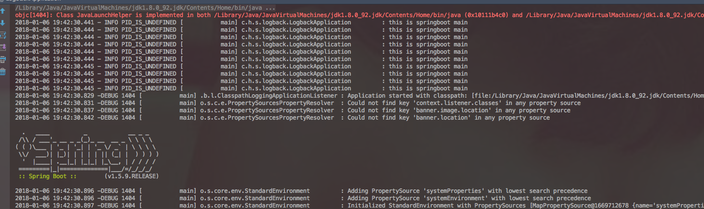
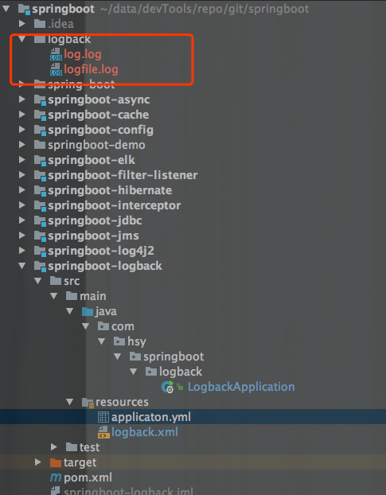

## 前言

日志系统几乎是每个项目必备的重要组成部分。但logback和log4j以及log4j2三者，推荐使用logback，因为logback的效率显著高于log4j，而且logback也是springboot推荐及默认使用的日志系统。

## 方法

在Spring Boot 中记录日志只需两步：

1、在 src/main/resources 下面创建logback.xml 文件。

2、在Java代码中创建实例，并在需要输出日志的地方使用。

## code实现

在src/main/resources新建logback.xml

```xml
<?xml version="1.0" encoding="utf-8"?>
<configuration scan="true" scanPeriod="10 seconds">

    <!-- 文件输出格式 -->
    <property name="pattern" value="%d{yyyy-MM-dd HH:mm:ss.SSS} -%5p ${PID:-} [%15.15t] %-40.40logger{39} : %m%n" />
    <property name="charsetEncoding" value="UTF-8" />
    <!--<PatternLayout pattern="%d{HH:mm:ss.SSS} %-5level %class{36} %L %M - %msg%xEx%n"/>-->

    <!--控制台日志-->
    <appender name="console" class="ch.qos.logback.core.ConsoleAppender">
        <encoder>
            <pattern>${pattern}</pattern>
            <charset>UTF-8</charset>
        </encoder>
    </appender>

    <appender name="file" class="ch.qos.logback.core.FileAppender">
        <file>./logback/logfile.log</file>
        <append>true</append>
        <encoder>
            <pattern>${pattern}</pattern>
            <charset>${charsetEncoding}</charset>
        </encoder>
    </appender>

    <appender name="dailyRollingFileAppender" class="ch.qos.logback.core.rolling.RollingFileAppender">
        <File>./logback/log.log</File>
        <rollingPolicy class="ch.qos.logback.core.rolling.TimeBasedRollingPolicy">
            <!-- daily rollover -->
            <FileNamePattern>logback.%d{yyyy-MM-dd_HH}.log</FileNamePattern>
            <!-- keep 30 days' worth of history -->
            <maxHistory>7</maxHistory>
        </rollingPolicy>
        <encoder>
            <Pattern>${pattern}</Pattern>
        </encoder>
    </appender>

    <logger name="org.springframework.web" level="debug"/>
    <!-- show parameters for hibernate sql 专为 Hibernate 定制 -->
    <logger name="org.hibernate.type.descriptor.sql.BasicBinder" level="TRACE" />
    <logger name="org.hibernate.type.descriptor.sql.BasicExtractor" level="DEBUG" />
    <logger name="org.hibernate.SQL" level="DEBUG" />
    <logger name="org.hibernate.engine.QueryParameters" level="DEBUG" />
    <logger name="org.hibernate.engine.query.HQLQueryPlan" level="DEBUG" />

    <!--myibatis log configure-->
    <logger name="com.apache.ibatis" level="TRACE"/>
    <logger name="java.sql.Connection" level="DEBUG"/>
    <logger name="java.sql.Statement" level="DEBUG"/>
    <logger name="java.sql.PreparedStatement" level="DEBUG"/>

    <root level="debug">
        <appender-ref ref="console"/>
        <appender-ref ref="dailyRollingFileAppender"/>
        <appender-ref ref="file"/>
    </root>
</configuration>
```

代码


```java
@SpringBootApplication
public class LogbackApplication {
    private final static Logger _logger = LoggerFactory.getLogger(LogbackApplication.class);
    public static void main(String[] args) {
        for(int i=0;i<10;i++){
            _logger.info("this is springboot main");
        }
        SpringApplication.run(LogbackApplication.class,args);
    }
}
```

以上运行的效果


## 文件日志

系统日志全部写在一个文件会导致文件越来越大，这时候可以用文件日志来切分控制台日志


```xml
<appender name="dailyRollingFileAppender" class="ch.qos.logback.core.rolling.RollingFileAppender">
    <File>/usr/local/log/app.log</File>
    <rollingPolicy class="ch.qos.logback.core.rolling.TimeBasedRollingPolicy">
        <!-- daily rollover -->
        <FileNamePattern>logback.%d{yyyy-MM-dd}.log</FileNamePattern>
        <!-- keep 30 days' worth of history -->
        <maxHistory>30</maxHistory>
    </rollingPolicy>
    <encoder>
        <Pattern>%d{HH:mm:ss.SSS} [%thread] %-5level %logger{35} - %msg %n</Pattern>
    </encoder>
</appender>
```

logback.%d{yyyy-MM-dd}.log定义了日志的切分方式——把每一天的日志归档到一个文件中，30表示只保留最近30天的日志，以防止日志填满整个磁盘空间。同理，可以使用%d{yyyy-MM-dd  HH:mm:ss SSS}来定义精确到分的日志切分方式。

## 运行效果图





## 历史文章


[SpringBoot实战之入门](http://blog.csdn.net/u012806787/article/details/78694912)

[springboot实战之文章汇总](http://blog.csdn.net/u012806787/article/details/78686998)

[springboot实战之读取配置文件](http://blog.csdn.net/u012806787/article/details/78583814)

[springboot实战之整合jsp模版引擎](http://blog.csdn.net/u012806787/article/details/78700999)

[springboot实战之整合freemarker模版引擎](http://blog.csdn.net/u012806787/article/details/78706156)

[springboot实战之注册自定义Servlet](http://blog.csdn.net/u012806787/article/details/78710113)

[springboot实战之注册filter和listener](http://blog.csdn.net/u012806787/article/details/78715725)

[springboot实战之注册interceptor](http://blog.csdn.net/u012806787/article/details/78719429)

[springboot实战之整合slf4j日志系统](http://blog.csdn.net/u012806787/article/details/78725259)

[springboot实战之整合CommandLineRunner](http://blog.csdn.net/u012806787/article/details/78722025)